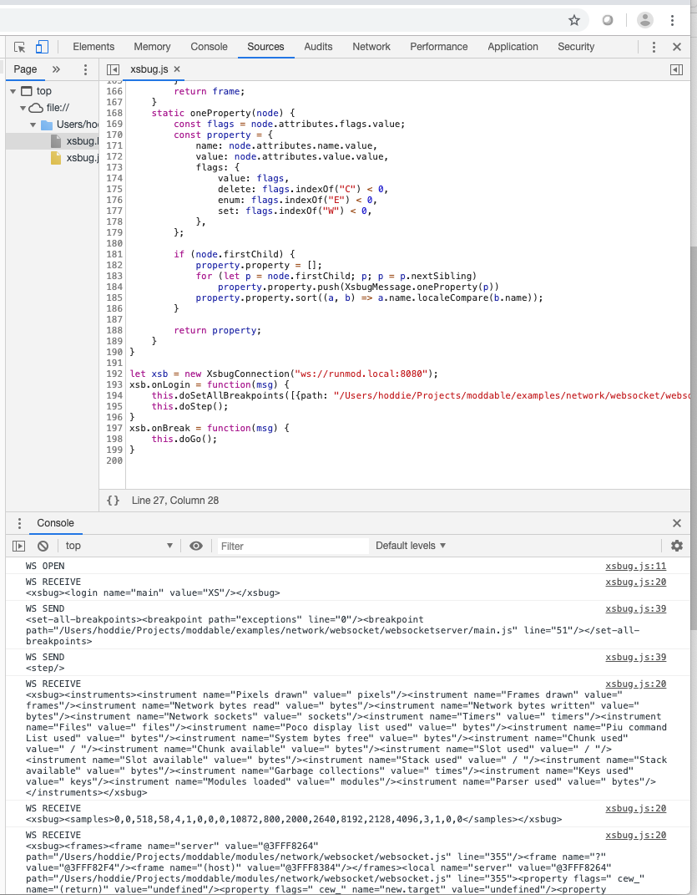

# Building and Installing JavaScript Mods
#### Copyright 2019, Moddable Tech Inc.
#### Updated April 7, 2019

This project is a simple example of how to install and run mods (e.g. JavaScript modules) on a ESP8266 and ESP32 microcontrollers using the [Moddable SDK](https://github.com/Moddable-OpenSource/moddable). The project has two parts: the host application and the mods.

> **Note**: This document discusses experimental features of the Moddable SDK. The intended audience is developers of tools interested in exploring the potential of we browser-hosted tools for JavaScript on microcontrollers. It describes how to deploy pre-compiled JavaScript modules to a microcontroller and how to communicate with a microcontroller for debugging. 

The host application is the base firmware for the microcontroller. It is the built-in software that defines the behavior of the device and is available for mods to use. When writing JavaScript for a web page, the browser is the host. When writing JavaScript for a server, Node.js is the host. The `runmod` host contains the XS JavaScript virtual machine, the HTTP server used to upload the mods, and the device firmware for the ESP8266, including Wi-Fi networking. The host is approximately 650 KB, leaving about 375 KB of space for mods.

The JavaScript source code of mods is compiled to byte-code on a development machine, not the microcontroller. The XS Compiler (xsc) and XS Linker (xsl)  compile and link the modules to be installed into an XS Archive file, which can contain one or more modules. The archive is uploaded to the microcontroller over HTTP. Once on the microcontroller, the archive is automatically remapped to match the symbol table of the host.

> Note: The computer portions of this project are intended for use on macOS. It should be possible to use it on Windows and Linux as well, with small changes. The microcontroller portions are for the ESP8266 and ESP32.

This example concisely demonstrates how to build, install, and run mods. It is not intended to be production code. Please learn from this project. Please do not ship it.

This document assumes the `runmod` directory is located in the Moddable SDK at the following path `$MODDABLE/examples/experimental/runmod`. You may put it elsewhere, but you will need to change the paths.

The motivation for creating this project is a [question](https://github.com/Moddable-OpenSource/moddable/issues/116) asked by [FWeinb](https://github.com/FWeinb). Thank you. 

## Host
To build, install, and launch the `runmod` application on an ESP8266 or ESP32, follow the usual steps for the [network examples](https://github.com/Moddable-OpenSource/moddable/tree/public/examples#wi-fi-configuration) in the Moddable SDK.

```
cd $MODDABLE/examples/experimental/runmod
mcconfig -d -m -p esp ssid=“MY_WIFI” password="MY_WIFI_PASSWORD"
```

If everything goes well, in the xsbug debugger you will see the Wi-Fi connection being established:

	Wi-Fi connected to "MY_WIFI"
	IP address 192.168.1.24

Next you'll see an exception in the xsbug debugger telling you there's no mod installed yet. That's true. Just press the Run button to continue execution.

	/moddable/examples/experimental/runmod/main.js (80) # Break: require: module "mod" not found!

Finally, the microcontroller will claim the mDNS name `runmod` on the local network. 

	probe 1
	probe 2
	probe 3
	probe claimed runmod

At this point, the host is ready to receive a mod. The host is available on the local network at the IP address shown as well as using the mDNS name `runmod.local`.

There is one important detail to be aware of. The `manifest.json` of `runmod` has a special define to enable mod support:

	"defines": {
		"XS_MODS": 1
	},

Because of this, you must do a clean build for `runmod`. An easy way to do that is to manually delete `$MODDABLE/build/tmp/esp` and `$MODDABLE/build/bin/esp`.

## Mods
This project contains three sample mods - hello world, http get, and ping. Each illustrates a different capability. The process for building and installing each of them is the same.

- `helloworld` -- traces "hello world" to the xsbug console and then traces the numbers from 1 to 10 using a `for` loop.
- `httpget` -- uses an HTTP GET to retrieve the home page of `wwww.example.com` and trace it to the xsbug console.
- `ping` -- implements a simple network ping client, continuously pinging `www.moddable.com` and tracing the responses to the xsbug console.

### Building
To build the `helloworld` mod, run the following commands:

	cd $MODDABLE/examples/experimental/runmod/mods/helloworld
	mkdir -p build
	xsc ./mod.js -d -e -o ./build
	xsl -a -b ./build -o ./build -r mod ./build/mod.xsb

This compiles the script and creates an archive in `helloworld/build/mod.xsa`.

The `httpget` mod is built the same way, just change the `cd` path to `$MODDABLE/examples/experimental/runmod/mods/httpget`.

The `helloworld` and `httpget` mods each consist of a single module named `mod`.  The `helloworld` mod is self contained and so does not import any modules from the host; the `httpget` mod imports the `http` module from the host. The `ping` mod has two modules -- the  main `mod` module  and the `ping` network protocol module. The `ping` protocol is included in the Moddable SDK. However, it is not built into the `runmod` host. Therefore, the `ping` mod must include the `ping` module in its archive. To do that requires building both modules independently using `xsc` and linking them together using `xsl`:

	cd $MODDABLE/examples/experimental/runmod/mods/ping
	mkdir -p build
	xsc ./mod.js -d -e -o ./build
	xsc $MODDABLE/modules/network/ping/ping.js -d -e -o ./build
	xsl -a -b ./build -o ./build -r mod ./build/mod.xsb ./build/ping.xsb

### Install
A mod is installed to `runmod` using an HTTP PUT. This project uses the `curl` command line tool for this. The mod is contained in an XS Archive, which is a single file with a `.xsa` extension. It is uploaded as follows:

	curl -T ./build/mod.xsa http://runmod.local/mod/install

If you don't have mDNS on your development machine, use the IP address instead:

	curl -T ./build/mod.xsa http://192.168.1.24/mod/install

Once the mod is installed, the microcontroller restarts. On restart, the mod is prepared for execution and then the `runmod` starts. Instead of the exception before ("Break: require: module "mod" not found!), you should see the mod begin to execute followed by "mod loaded" in the xsbug console.

### Uninstall
A mod is uninstalled with HTTP GET. Here's the curl command:

	curl http://runmod.local/mod/uninstall

Following the uninstall, the microcontroller restarts.

### Restart
Because mods are ECMAScript modules, they are only loaded once into a virtual machine. To re-run the top-level code in the mod, restart the JavaScript VM. 

	curl http://runmod.local/mod/restart

### Execution Environment
Because the mod is run as a dynamically loaded module on a microcontroller, the environment is constrained in various ways. The constrained speed and available RAM are well known challenges of embedded development. This section describes other details to be aware of.

#### Language Features
The XS JavaScript engine implements the JavaScript 2018 specification with a [very high degree of conformance](https://github.com/Moddable-OpenSource/moddable/blob/public/documentation/xs/XS%20Conformance.md). However, to fit the engine into the 1 MB of flash available on the ESP8266 together with the networking firmware while leaving space free for mods, some JavaScript features are removed. Invoking those features generates an exception. These are the features that are unavailable:

- Async functions
- Atomics
- eval
- Generators
- Promises
- Proxy
- RegExp
- SharedArrayBuffer

The choice of the JavaScript languages features to include and exclude is made by the developer of the host. The `runmod` manifest defines the features to be removed. To change the available language features, change the manifest.

> Note: Microcontrollers able to address a larger flash address space, such as the ESP32, may include more of the JavaScript language. For consistency, `runmod` provides the same features on an microcontrollers.

#### Symbols
Each unique property (variable) name in JavaScript must be tracked by the JavaScript engine. This is required to support various features of the language. The symbols used by the host are stored in flash. Each symbol used by the mod that is not also used by the host requires some RAM. The host is configured at build time to support a fixed number of symbols in RAM. When this limit is exceeded, an exception is generated. `runmod` is configured to support up to 256 unique symbols in the mod.

	"creation": {
		"keys": {
			"available": 256,
		},
	},

In practice, this is sufficient for most mods. If you need more, increase the number and rebuild `runmod`.

You can see the number of keys used while `runmod` is executing by looking at the "Keys used" area of the Instrumentation panel in xsbug.

#### Host / Built-in Modules
The host itself is built using JavaScript modules. Those modules are available to mods. The following modules from the Moddable SDK are built into the `runmod` host:

- dns
- dns/parser
- dns/serializer
- flash
- http
- mdns
- net
- sntp
- socket
- time
- timer
- wifi

The `manifest.json` of `runmod` controls which modules are built-in.

Modules that are built into the host are usually configured in the manifest to preload during the build. By preloading the modules, they use less RAM and load instantly. Modules contained in a mod, however, cannot be preloaded. Therefore, modules that are expected to be used by most mods should be built into the host, rather than delivered as part of the mod.

#### Native Code
Mods are JavaScript code, by definition. There is no native code in a mod. The XS JavaScript engine does support including native code in modules built into the host. For example, `runmod` includes a `restart` function to restart the microcontroller.

#### Configuration
By default, the install mod is run immediately on booting the microcontroller. The mod can be configured to run immediately after a debugger connection is established or never. The choice is configured by performing a GET on one of the following URLS:

 		http://runmod.local/mod/config/when/boot
 		http://runmod.local/mod/config/when/debug
 		http://runmod.local/mod/config/when/never

The name of the device may be changed from `runmod` by setting the name:

 		http://runmod.local/mod/config/name/mynewname
 
 > Note: `runmod` does not perform validation checks on the name provided. It must be a valid mDNS name, less than 32 characters. Using all lower-case letters is recommended.
 
## Debugging
The mods are built with debugging enabled (the `-d` option passed to `xsc`). If the host is connected to xsbug using a serial connection, the mod may be debugged using xsbug. For example, use xsbug to set a breakpoint on a line of source code or add a `debugger` statement to your mod's source code.

### Host debugging
"Host debugging" is when the debugging connection is established at the time the JavaScript virtual machine is created. Debugging begins at the first line of JavaScript source code that XS executes.

Host debugging of embedded devices using the Moddable SDK usually runs over a serial connection because serial is fast, reliable, and supported on nearly every microcontroller. Although seldom used, the debugging connection may also run over a network socket. In this case, the host must know the IP address of the computer running xsbug so that it can initiate a connection to the debug server running in xsbug.

### Mod debugging
This document introduces another approach to debugging, "mod debugging." Because a mod is not the first script a host executes, there is no need to connect to the debugger immediately. Further, the purpose of `runmod` is to be a host that works with only a browser-based IDE. Ideally "mod debugging" should support the equivalent of xsbug debugging in the web browser. This is challenging because:

- The implementation of network debugging in the Moddable SDK connects to an xsbug server. The web browser does not accept incoming connections, so cannot act as a server.
- In the xsbug protocol, messages are sent as XML documents over a TCP network socket. In the web browser, all communication occurs over a higher level protocol such as HTTP and WebSocket. There is no support in the web browser for general purpose communication over a plain TCP network socket.

### Debugging over WebSocket protocol
The WebSocket protocol is the obvious candidate to use to carry the xsbug protocol between the host and the browser because it is already bi-directional. Additionally, the Moddable SDK has a WebSocket client and server. However, the Moddable SDK implementation of WebSocket is written entirely in JavaScript. It cannot be used while debugging as execution of scripts is suspended while stopped at a breakpoint. Reimplementing all of the WebSocket protocol in native code to be used by the debugger is possible, but tedious.

The solution arrived at is as follows:

- `runmod` hosts a WebSocket server using the WebSocket JavaScript module from the Moddable SDK.
- The web browser connects to the WebSocket server at any time after the JavaScript virtual machine is running and Wi-Fi network connection has been established.
- The JavaScript WebSocket server establishes the WebSocket connection, including the upgrade from HTTP to WebSocket and sub-protocol negotiation.
- Once the handshake is complete, `runmod` detaches the network socket from the WebSocket connection and hands the native lwip socket off to the XS debugging support.
- The debugging implementation in XS operates as usual using the socket created by the WebSocket server, sending and receiving messages as if it is connected to xsbug.
- The debugging transport code in `xsPlatform.c` -- which already implements support for serial and socket based connection -- wraps outgoing messages in WebSocket text frames and removes the WebSocket framing information from incoming messages.

### To build
The experimental support for WebSocket debugging is not yet part of the Moddable SDK. To try it, it is necessary to manually patch the build. The files to replace are in [`runmod/patches` directory](https://github.com/phoddie/runmod/tree/master/patches/).

- `$MODDABLE/xs/platforms/esp/xsPlatform.h` -- define fields for WebSocket send and receive framing
- `$MODDABLE/xs/platforms/esp/xsPlatform.c` -- implement WebSocket transport support

### Implementation notes

1. The WebSocket server in `runmod` is available at port 8080. The Moddable SDK implementations of HTTP and WebSocket servers currently do not share the listener on port 80.
1. The WebSocket server uses a subprotocol of `x-xsbug`. Strictly speaking this is unnecessary, but it is done to be explicit about the kind of data being transported. Should the protocol changes in the future, this mechanism allows for protocol version negotiation.
1. Only one debugging connection may be active at a time. The Moddable SDK is configured to establish a host debugging connection over serial at start-up. To use mod debugging over WebSockets, there cannot be an active serial debugging connection. To ensure this, when a new incoming WebSocket connection arrives, any existing debugging connecting is closed.
1. The current implementation of WebSocket support in `xsPlatform.c` breaks support for host debugging directly to xsbug because it assumes the transport is always WebSocket. This needs to be made an option.
1. On a clean shut-down the server sends a WebSocket close message.

### From the browser
To try out the mod debugging connection from the browser, [a small test](https://github.com/phoddie/runmod/tree/master/html/) is provided in the repository. It connects to `runmod` over WebSockets, sets a breakpoint, and traces messages to the console. It is not a useful example, it is just a starting point.

The most useful part of the example is the `XsbugConnection` class which takes care of establishing the connection as well as sending and receiving messages. Each message in the xsbug protocol is an XML document. The `XsbugConnection` converts incoming messages to JavaScript objects and generates outgoing XML messages in response to JavaScript function calls. The class has been tested, but there may still be bugs and missing features.

#### Connecting
To establish a connection, pass the URI to the `XsbugConnection` constructor:

	let xsb = new XsbugConnection("ws://runmod.local:8080");

#### Receiving messages
The `XsbugConnection` instance provides callback functions for each message type sent by xsbug. To receive a message, provide the corresponding callback:

	xsb.onLog = function(msg) {
		console.log(msg.log)
	}

The following callbacks are available:

- `onBreak` -- a breakpoint was hit - either a breakpoint that was set, a debugger statement, or an exception
- `onInstrumentationConfigure` -- the names and labels for all instrumentation fields
- `onInstrumentationSamples` -- the current values for all instrumentation fields
- `onLocal` -- one local stack frame
- `onLog` -- a log message, such as generated by a call to the global `trace` function
- `onLogin` -- the first message sent when the connection is established
- `onClose` -- the connection was closed by the microcontroller (for example, prior to restart)
- `onError` -- the connection is no longer usable due to an error

#### Sending messages
The `XsbugConnection` instance provides functions to send each type of request supported by the XS debugging implementation.

- `doClearBreakpoint(path, line)` -- removes a breakpoint
- `doGo()` -- resumes execution from a breakpoint
- `doSetBreakpoint(path, line)` -- sets a breakpoint
- `doSelect(value)` -- selects a local stack frame. The contents of the stack frame are sent immediately and the `onLocal` callback is invoked with the result.
- `doSetAllBreakpoints(breakpoints, exceptions)` -- set multiple breakpoints. This is usually sent when the `onLogin` is received. Execution begins when this is received by XS. The `exceptions` argument is optional and defaults to true, which causes XS to break in the debugger on JavaScript exceptions.
- `doStep` -- execute until the next line of source code
- `doStepInside` -- execute and break inside the next function called
- `doStepOutside` -- execute and break when returning from the current function call.
- `doToggle` -- request that the given object toggle its state for reporting its contents. This is equivalent to clicking the turn down arrow in xsbug that appears to the left of objects.

#### Exploring the xsbug protocol
The xsbug protocol is undocumented. Some experimentation will be needed to use it. The [source code of xsbug](https://github.com/Moddable-OpenSource/moddable/tree/public/tools/xsbug) is available, which provides a working example. Running xsbug locally with the simulator together with Wireshark is a good way to see how user interface features correspond to protocol messages.

The protocol is quite simple. It relies on the debugger application to do much of the work. The protocol is designed to be as minimal as practical so it can fit comfortably inside a microcontroller as part of the XS engine.

#### Putting it together
The image below shows the example application running in the Chrome web browser. The messages sent between the browser and the microcontroller are displayed in the console.

